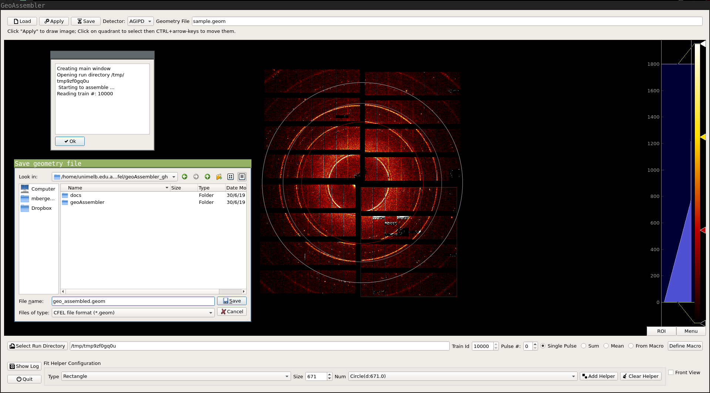

o# Ring Based Detector Geometry Calibration Tool

This repository provides a tool to calibrate AGIPD detector geometry information

The tool can be seen as an alternative to the calibration mode of CrysFEL's
hdfsee. The calibration can either be based on a starting geometry that needs
to be refined or a completely new geometry. In the latter case the initial
conditions for the geometry are defined so that all modules are
29px apart from each other.

The geometry calibration is supported by two modes of graphical user interfaces.
A Qt-based and a jupyter notebook based interface.

## Using the Qt-Gui
It is recommended to use this Gui application through the pre-installed path
on the on- and offline cluster.

```bash
source /gpfs/exfel/sw/software/modules
module load xfel_anaconda3
```
The following optional arguments can be set via the command line:

| Argument  |   | Description  |
|---|---|---|
|  -h, --help |   |   |
|  -nb, --notebook |   | Do not start gui, create a notebook  |
|  -r, --run |  run_dir |  The path name to a exp folder |
|  -g, --geometry| geomfile  | Path to geometry file |
|  -c, --clen    |  clen |  Detector distance [m] |
|  -e, --energy  |  energy | Photon energy [ev]  |
|  -l, --level   |  min max | Display range for plotting  |



If no run directory, using ```-r/--run```, option has been preselect a
directory can to be set by clicking the Run-dir button. Train id's can be
selected after a run has been selected. The user can either choose to display
images by pulses or if the signal is to week/noisy by applying a Maximum or
Mean across the entire train to all images.
To do so the user can just select the *Max* or *Mean* button
instead of the default  *Sel #*. After an image number / function has been
selected the image can be assembled using the *Assemble* button.
Optionally a pre-defined geometry file can be loaded using the *Load* button.

After the image is displayed quadrants can be selected by clicking on them.
They can be moved by using the ```Ctrl+arrow-up/down/left/right```
key combination. Circles that can help to align quadrants are added
by the *Draw Helper Objects* button. The radii of the circles an be adjusted
using the radius *spin box* in the top left.

Once the quadrants have been positioned a geometry file can be saved by
using the *Save* button.

## Calibration Using Jupyter
The -nb, --notebook flag provides the user the option to create a notebook
explaining in the home direcory of the user.

## Setup
It is recommended to use the already setup application available in xfel's
anaconda3 distirbution.
### Dependencies
The following python packages should be available:
 - numpy
 - cfelpyutils
 - pyqtgraph
 - matplotlib
 - ipywidgets
 - pyqt5
 - pyFAI

All packages should be available via the xfel's anaconda3 module. At the moment
the module has to be activated by
```bash
source /gpfs/exfel/sw/software/modules
module load xfel_anaconda3
```


## Testing:
Testing the implementation is done py pytest. To apply the test suite run

```bash
$: pytest -v geoAssembler/tests
```
